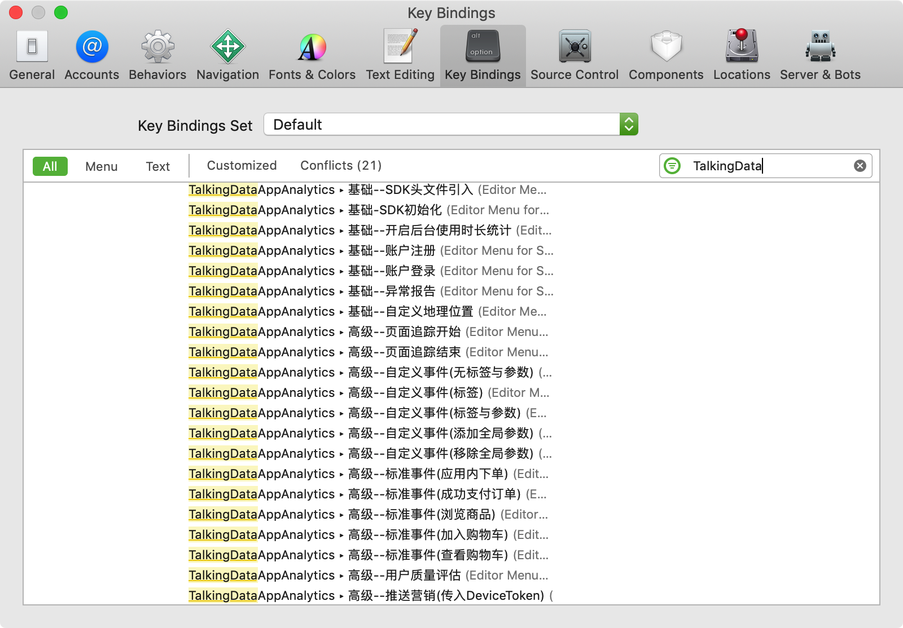
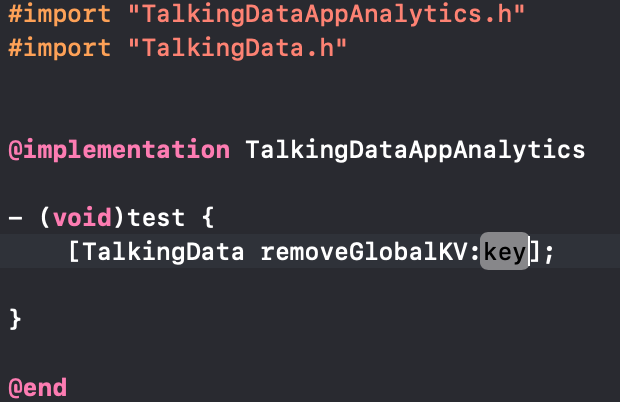

# TalkingData-SDK-plugin for Android Studio&Xcode

## 介绍
TalkingData-SDK-plugin 是一款基于TalkingData AppAnalytics SDK的示例代码生成插件，专注于为开发者提效，使集成TalkingData SDK变得简单高效。

## 目录

* [INSTALL & 安装](#install)
* [Usage &  使用](#usage)
* [API & 示例](#api)
* [LICENSE & 许可](#license)

---

## 版本支持

⚠️ 支持 `Android Studio 2.0+` `JDK 1.8`

⚠️ 支持 `Xcode 8+` `macOS 10.11+`

## INSTALL & 安装

### 手动安装

#### android

下载插件`talkingdata-app-plugin.jar`

通过 Install plugin from disk 选择下载的jar包，安装本地插件

</img>

#### iOS

下载插件`TalkingDataSDKExtension.app`

拖动`TalkingDataSDKExtension.app`到应用程序中，双击打开，然后退出

</img>

系统设置->扩展程序->Xcode Source Editor->开启插件

</img>

重启Xcode，此时在Xcode的编辑菜单中，将显示插件的具体内容

</img>

---

## Usage &  使用

### 手动

#### android

在java文件中右键，选择对应功能即可插入示例代码

</img>

#### iOS

在.m文件中，通过菜单栏Editor中的TalkingDataAppAnalytics子菜单，选择对应功能即可插入示例代码到光标所在处

</img>

### 快捷键

可以通过设置快捷键的方式，为每一个动作设定自己喜欢的快捷键，设置好之后，可以直接使用快捷键的方式使用插件。设置快键键的方式如下：

#### android

在Android Studio的设置中选择Keymap，然后在搜索栏中键入TalkingData，将会搜索到和本插件相关的所有指令；

为指令设置快捷键（快捷键的设置需要避免重复）；

#### iOS

在Xcode的Preferences中选择Key Bindings，然后在搜索栏中键入TalkingData或者AppAnalytics，将会搜索到和本插件相关的所有指令；

为指令设置快捷键（快捷键的设置需要避免重复）；

---

## API & 示例

### android

#### TalkingData初始化

</img>

---

#### TalkingData自定义事件

</img>

---

#### TalkingData页面

</img>

---

#### TalkingData登录

</img>

---

#### TalkingData注册

</img>

---

#### TalkingData订单

</img>

---

#### TalkingData订单支付成功

</img>

---

#### TalkingData添加物品到购物车

</img>

---

#### TalkingData查看物品

</img>

---

#### TalkingData查看购物车

</img>

---

### iOS

#### SDK初始化

</img>

---

#### 开启后台使用时长统计

</img>

---

#### 用户注册

</img>

---

#### 用户登录

</img>

---

#### 异常报告

</img>

---

#### 自定义地理位置

</img>

---

#### 页面追踪开始

</img>

---

#### 页面追踪结束

</img>

---

#### 自定义事件

</img>

---

#### 自定义事件（添加全局参数）

</img>

---

#### 自定义事件（移除全局参数）

</img>

---

#### 应用内下单

</img>

---

#### 成功支付订单

</img>

---

#### 查看商品

</img>

---

#### 添加商品到购物车

</img>

---

#### 查看购物车

</img>

---

#### 用户质量评估

</img>

---

## LICENSE & 许可

[MIT LICENSE](LICENSE)

