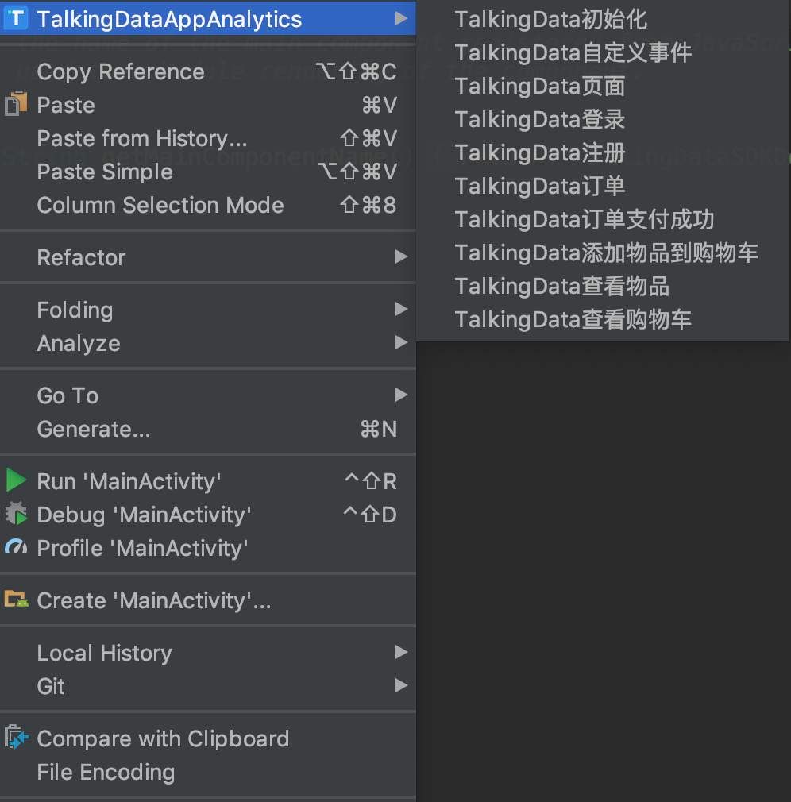
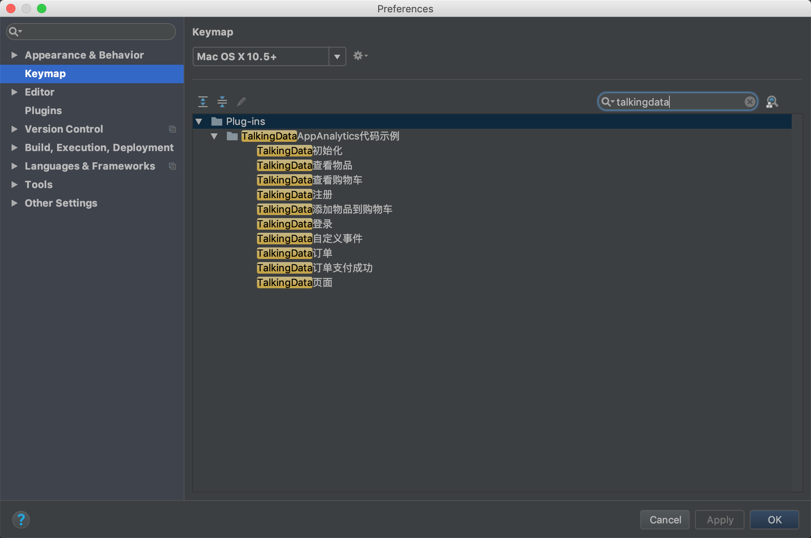
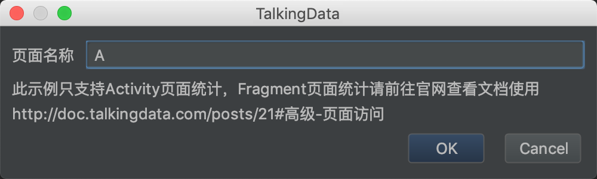
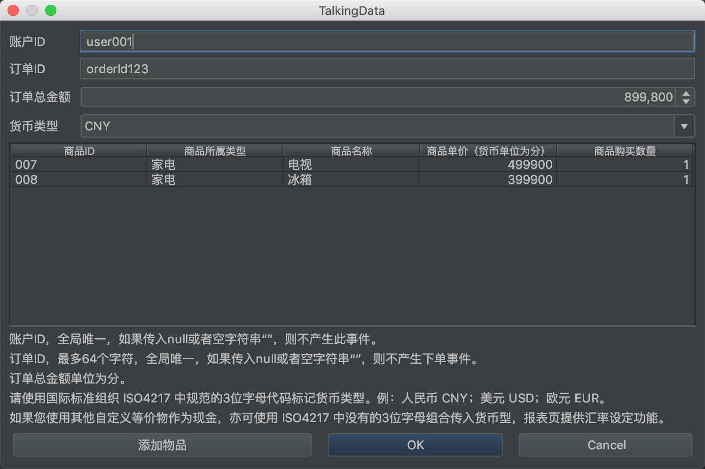
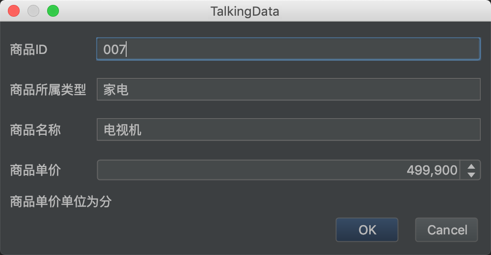

# talkingdata-app-plugin

## 目录

* [INSTALL & 安装](#install)
* [Usage &  使用](#usage)
* [API & 示例](#api)
* [LICENSE & 许可](#license)

---

## INSTALL & 安装

###手动安装

下载插件talkingdata-app-plugin.jar

通过 Install plugin from disk 选择下载的jar包，安装本地插件

</img>

---

## Usage &  使用

### 手动

在java文件中右键，选择对应功能即可插入示例代码

</img>

### 快捷键

可以通过设置快捷键的方式，为每一个动作设定自己喜欢的快捷键，设置好之后，可以直接使用快捷键的方式使用插件。设置快键键的方式如下：

在Android Studio的设置中选择Keymap，然后在搜索栏中键入TalkingData，将会搜索到和本插件相关的所有指令；

为指令设置快捷键（快捷键的设置需要避免重复）；

---

## API & 示例

### TalkingData初始化

</img>

---

### TalkingData自定义事件

</img>

---

### TalkingData页面

</img>

---

### TalkingData登录

</img>

---

### TalkingData注册

</img>

---

### TalkingData订单

</img>

---

### TalkingData订单支付成功

</img>

---

### TalkingData添加物品到购物车

</img>

---

### TalkingData查看物品

</img>

---

### TalkingData查看购物车

</img>

---

## LICENSE & 许可

[MIT LICENSE](LICENSE)

